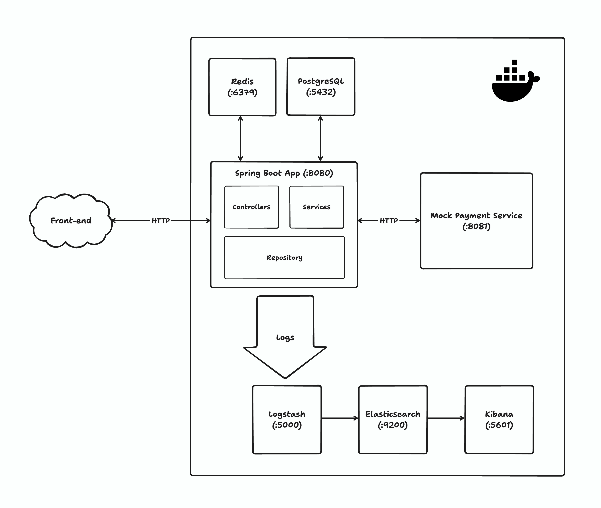
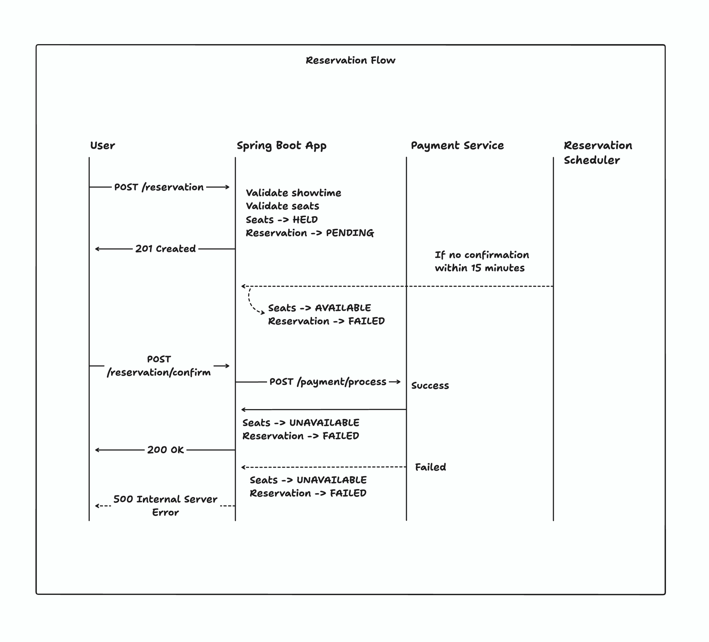
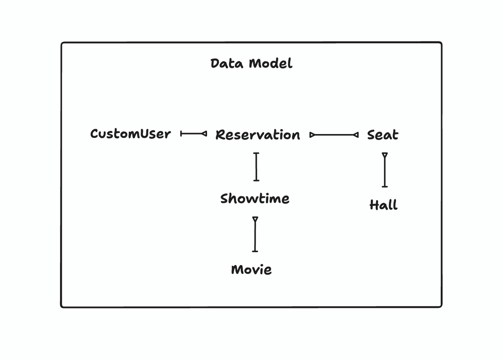

# Movie Reservation System

A RESTful backend service for managing movie reservations. Supports seat booking with mock payment service integration, role-based access control, Redis caching, and centralized logging via the ELK stack.

---

## Table of Contents

- [Architecture Overview](#architecture-overview)
- [Technology Stack](#technology-stack)
- [Key Components](#key-components)
  - [REST API Layer](#rest-api-layer)
  - [Reservation Flow](#reservation-flow)
  - [Payment Integration](#payment-integration)
  - [Schedulers](#schedulers)
  - [Security](#security)
  - [Caching](#caching)
  - [Logging & Monitoring](#logging--monitoring)
- [Data Model](#data-model)
- [Getting Started](#getting-started)
- [API Access Control](#api-access-control)

---

## Architecture Overview



All services (app, PostgreSQL, Redis, Logstash, Elasticsearch, Kibana) are run via Docker Compose.

---

## Technology Stack

| Category   | Technology                      |
| ---------- | ------------------------------- |
| Language   | Java 21                         |
| Framework  | Spring Boot 4                   |
| Database   | PostgreSQL                      |
| Cache      | Redis                           |
| Security   | Spring Security, JWT, OAuth2    |
| Logging    | Logback + Logstash encoder      |
| Monitoring | Elasticsearch, Logstash, Kibana |
| Build tool | Maven                           |
| Utilities  | Lombok, Jakarta Validation      |

---

## Key Components

### REST API Layer

Six controllers expose the public API:

| Controller              | Base Path      | Responsibility                           |
| ----------------------- | -------------- | ---------------------------------------- |
| `UserController`        | `/user`        | Registration, login, password management |
| `MovieController`       | `/movie`       | CRUD for movies and genres               |
| `HallController`        | `/hall`        | Cinema hall management                   |
| `SeatController`        | `/seat`        | Seat creation and status queries         |
| `ShowtimeController`    | `/showtime`    | Scheduling movie screenings              |
| `ReservationController` | `/reservation` | Full reservation lifecycle               |

---

### Reservation Flow

The reservation is one of the core features. It's flow:


**Pricing** is calculated as the sum of individual seat base prices multiplied by a showtime-type multiplier:

| Showtime Type | Multiplier |
| ------------- | ---------- |
| STANDARD      | 1.0×       |
| PREMIERE      | 1.5×       |
| PREVIEW       | 2.0×       |

---

### Payment Integration

The application integrates with an external payment service over HTTP:

- **Charge**: `POST http://localhost:8081/payment/process`
- **Refund**: `POST http://localhost:8081/payment/refund`

Requests include `reservationId`, `userId`, and `amount`. Responses return a `PaymentStatus` (`SUCCESS`, `FAILED`, `REFUND_SUCCESS`, `REFUND_FAILED`). A failed refund throws `FailedPaymentException` and the cancellation is aborted.

---

### Schedulers

As we need to change showtimes' and seats' statuses, it is decided to use schedulers. They run in long _(relatively)_ intervals, so they don't resolve into poor performance.

It is not the only method for changing statuses – we also validate it during request, so in case showtime has passed but scheduler didn't set it to COMPLETED yet, then request would be failed and appropriate statuse set.

So we run two background schedulers:

| Scheduler              | Interval         | Action                                                                                                       |
| ---------------------- | ---------------- | ------------------------------------------------------------------------------------------------------------ |
| `ReservationScheduler` | Every 60 seconds | Finds PENDING reservations older than 15 minutes; releases HELD seats -> AVAILABLE; marks reservation FAILED |
| `ShowtimeScheduler`    | Every 30 minutes | Finds UPCOMING showtimes whose datetime has passed; marks them COMPLETED to prevent new bookings             |

---

### Security

- **JWT** tokens are issued on login (30-minute expiry, SHA256). Every request is intercepted by `JWTFilter`, which extracts the token from `Authorization: Bearer <token>` and validates it.
- **BCrypt** (strength 12) is used for password's protection.
- **OAuth2** is supported for authentication instead of JWT.
- Public endpoints: `POST /user/register`, `POST /user/login`.

---

### Caching

`Showtime` and `Movie` are cached in Redis using Spring's `@Cacheable` annotation with a 10-minute TTL. It is decided to go with approach that cache entries are destroyed on any create, update, or delete operation via `@CacheEvict(allEntries = true)`, because creation of new showtimes and movies, from a business-perspective, is rare.

---

### Logging & Monitoring

A simple logging via EKL stack is added, also it doesn't inlude any pre-made dashboards or configuration for Kibana out of the box.

The Logstash forwards logs to Elasticsearch, which Kibana usses for dashboards and search. You can find loggin in key aspects like reservations, authentication, payment requests/responses, and all exceptions.

---

## Data Model



| Entity        | Key Fields                                                 |
| ------------- | ---------------------------------------------------------- |
| `CustomUser`  | id, username, email, password (hashed), role               |
| `Movie`       | id, title, description, posterUrl, genres                  |
| `Hall`        | id, hallNumber, seats                                      |
| `Seat`        | id, seatNumber, rowNumber, price, type, status, hall       |
| `Showtime`    | id, dateTime, type, status, movie, hall                    |
| `Reservation` | id, status, generalPrice, timestamp, user, seats, showtime |

---

## Getting Started

### Prerequisites

- Docker and Docker Compose

### Run

```bash
docker compose up --build
```

The API is available at `http://localhost:9090`.

### Environment variables (passed to the app container)

| Variable                     | Default                                    | Description       |
| ---------------------------- | ------------------------------------------ | ----------------- |
| `SPRING_DATASOURCE_URL`      | `jdbc:postgresql://postgres:5432/postgres` | Database URL      |
| `SPRING_DATASOURCE_USERNAME` | `postgres`                                 | DB user           |
| `SPRING_DATASOURCE_PASSWORD` | `postgres`                                 | DB password       |
| `LOGSTASH_HOST`              | `logstash`                                 | Logstash hostname |

---

## API Access Control

| Role    | Allowed operations                                                                                                                          |
| ------- | ------------------------------------------------------------------------------------------------------------------------------------------- |
| `USER`  | Register, login, create reservation, view own reservations                                                                                  |
| `ADMIN` | All USER operations + update/delete reservations, manage movies/halls/seats/showtimes, view revenue reports, trigger manual charges/refunds |

Roles are enforced via `@PreAuthorize` annotations at the controller method level.
